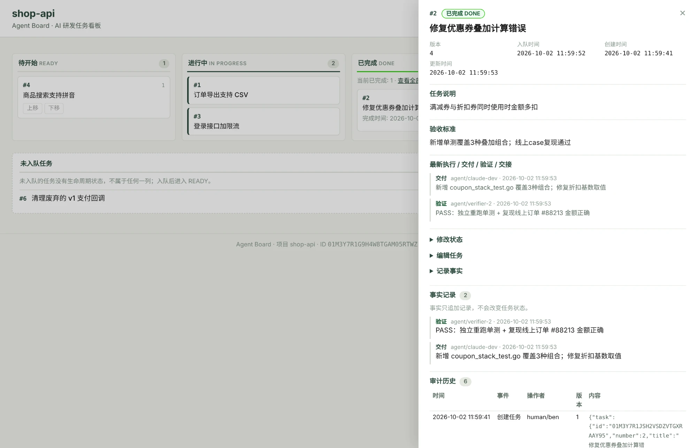

# Agent Board · AI 研发工单制

[中文](README.md) | [English](README_EN.md)

**让交给 AI 的每一项工作，都有明确责任、有证据交付、有独立验收、有记录可追溯。**

Agent Board 首先是一套 **AI 研发工作制度**：规定什么工作值得成为工单、谁作为执行者承担工作、什么算交付、谁有资格独立验收，以及中断、返工和人的裁决如何留下记录。

这套制度被写成与具体工具无关的工作流规则；`aboard` 是它的本地参考实现，让不同 AI 智能体、不同会话、不同执行工具共享同一份任务事实。

## 为什么需要一套“制度”

模型越来越擅长规划、拆解、自检和管理自己的上下文。这些内部步骤可以继续留在 Codex、Claude Code、OpenCode 或其他执行工具里。

但一旦多个 AI 智能体跨会话、跨工作树（worktree）、跨工具协作，真正麻烦的问题变成了：

- 这项工作到底是什么，什么才算完成？
- 现在谁在做？中断以后谁可以接手？
- AI 说“做完了”，凭什么接受？
- 做的人能不能自己宣布验收通过？
- 退回修改以后改了什么，谁重新验证？
- 两周后回头看，当时交付了什么、谁验的、为什么放行？

这些问题不会随着模型变强而消失。它们不是智能问题，而是**分工、交接、验收和责任边界**的问题。

**核心规则本身并不依赖软件开发，但研发是当前第一个、也是已经过实际项目验证的应用领域。** 其他领域是否采用同样的证据和验收细则，需要分别验证，而不是在这里预设。

人类研发团队靠工单、代码审查和验收记录处理这类问题。AI 研发也需要一套明确、能被智能体自己遵循的规则。

## 核心规则

1. **可独立委托的工作，一事一单。** 只有能被独立调度、独立验收、必要时独立交接的工作才进入看板。执行者自己的待办、计划、子步骤和子智能体拆分留在执行工具内部。
2. **先明确边界，再授权执行。** 工单要写清目标、范围和可检查的验收标准；创建工单不等于开工，进入“待执行”（`READY`）才代表获得执行授权。同一工单的工作区，同一时刻最多只有一个当前执行者。
3. **交付必须附证据。** “做完了”不是结论。执行者要记录改了什么、基于什么基线、做了哪些检查、结果是什么、哪些内容没有验证以及原因。
4. **做的人不验收。** 执行者可以自检，但不能自己宣布“通过”（`PASS`）。每一轮正式验收都由一个新的、独立会话或实例完成，结论是“通过”（`PASS`）、“退回修改”（`RC`）或“阻塞”（`BLOCKED`）。
5. **返工不另起炉灶。** 退回修改后继续在原工单和原交付边界上修正；修正后形成新的交付记录，再由新的独立验收者完整复验。交付、验收和交接记录只追加、不覆盖。
6. **状态不靠任何一个智能体的记忆。** 中断或接管时，从工单与看板事实、工作区与 Git、以及智能体活动记录中恢复事实；必要的交接记录只补充缺失上下文，不另建一份 `PROGRESS.md`。

人始终拥有产品意图、待执行优先级以及推送、合并、发布等不可逆动作的最终授权权。调度者负责安排工作和记录状态，不承担工单执行，也不做验收；执行者负责执行和交付；独立验收者只读验收。

> **智能体管自己的内部步骤；制度只约束必须跨执行者保留下来的责任、证据和裁决。**

## 参考实现：`aboard`

Agent Board 把上面的规则落到一份外部、持久、可追溯的任务账本里。操作者身份是写入方提供的标签，不代表经过身份认证。

**看板只是视图。真正的核心是：规则 + 工单账本 + 证据与裁决。**


- **外部事实源**：任务状态不寄托在某个智能体的上下文、待办或进度文件里
- **独立验收**：执行者交付，新的独立验收者验证
- **记录可追溯**：交付、验证、交接和决策都有历史记录
- **跨工具协作**：命令行、MCP 和网页看板操作同一份事实，不绑定 Claude Code、Codex、OpenCode 或特定模型
- **本地优先**：一个二进制程序 + SQLite，无账号、无托管服务、无数据库服务器

实现层面的工单状态刻意保持简单：

- `READY`：待执行
- `IN_PROGRESS`：执行中
- `DONE`：已完成
- `BLOCKED`：阻塞

执行者、验收者、退回修改、交接、会话都不是额外的顶层状态；它们只是围绕工单发生的执行与决策记录。

## 它不是什么

不是 IDE，不是 AI 智能体，不是智能体执行框架，也不是调度器。

你继续在原来的工具里讨论和开发，也可以继续用 Paseo 或其他调度工具做并发执行。Agent Board 不接管智能体的内部计划，不做模型路由，也不试图把所有流程塞进看板。

**代码提供能力，工作流规则定义制度。看板是账本，不是流程引擎。**

## 一张工单怎么走完

假设你在开发 `shop-api`，发现一个问题：满减券和折扣券叠加时多扣钱。

**① 先定义工单，不开工**

> 把这个问题建成工单，验收标准写清楚，先别开工。

工单创建后先由人确认。只有进入 `READY`，才代表它获得执行授权。

**② 执行者执行并交付证据**

> 执行待执行队列，遵循 `agent-board-workflow`。遇到需要我决定的事就停下报告。

执行者自己管理内部计划，完成后留下稳定的工作区、交付记录和足够的验证证据。

**③ 独立验收者验收**

由一个**全新、独立的会话或实例**，按照工单、完整代码差异和验收标准复核，而不是让执行者自己宣布完成。

- 通过（`PASS`，仅由独立验收者给出）→ 接受已验证的交付 → 封装已验收提交 → 完成（`DONE`）
- 人明确接受 → 记录 `decision` 事实（不记录为 `PASS`）→ 完成（`DONE`）
- 退回修改（`RC`）→ 执行者修正 → 形成新的交付 → 由新的独立验收者复验
- 阻塞（`BLOCKED`）或需要人决策 → 停下并记录原因



你回来看到的不是“AI 说自己做完了”，而是：

**做了什么 → 留了什么证据 → 谁独立验过 → 为什么可以接受。**

人的注意力只留给三件事：**做什么、先做什么、分歧怎么裁决。**

## 它和 GitHub Issues / PR 是什么关系

Agent Board 不试图替代 GitHub。

GitHub Issues、PR、持续集成和代码审查，非常适合代码托管平台内的协作和收口；Agent Board 关注的是更靠近执行现场的那一层：**本地、多工作树、多执行工具、多智能体之间的执行、交接和独立验收事实。**

语义上可以自然对应：

- 看板工单 ↔ Issue / 工作项
- 执行者交付 ↔ 实现结果 / PR 候选
- 验收证据 ↔ 持续集成 / 代码审查证据
- 通过与关闭 ↔ 接受交付 / 合并边界

如果你的团队最终能直接用 GitHub 或其他平台完整承载同样的规则，也没有问题。**规则不应该依赖 Agent Board 才成立。**

`aboard` 的价值，是提供一个轻量、本地、可直接被 AI 智能体操作的参考实现。

## 和常见做法相比

| | TODO.md / PROGRESS.md | 智能体自带待办 | Issues / Linear | **Agent Board** |
|---|---|---|---|---|
| 跨会话、跨工作树共享 | 需要约定，容易分叉 | 通常局限于单次会话或单一工具 | ✓ | ✓ |
| 状态依据 | 文件内容 | 工具 / 会话内部状态 | 显式字段或自动化 | 显式记录，带自报 actor 标签和版本号 |
| “做完了”有没有证据 | 需自行约定 | 通常没有独立验收证据 | 依赖评论 / 持续集成 / 代码审查 | 交付 + 独立验收事实 |
| AI 能直接读写 | 能，但并发时容易冲突 | 通常只服务当前工具 | 需要 API / 鉴权 | 命令行 / MCP，带乐观锁 |
| 本地执行阶段的交接 | 需人工约定 | 通常不跨工具 | 通常围绕远端 Issue / PR | 原生记录交接与决策事实 |
| 部署成本 | 无 | 无 | 账号 / 网络 / 服务 | 本地二进制程序 + SQLite |

## 5 分钟开始

要求：**Go 1.25+**。

```bash
go install github.com/boboty/agent-board/cmd/aboard@latest
aboard skill install

cd your-project
aboard init
aboard doctor
aboard web
```

`aboard init` 需要在 Git 仓库内运行，它把项目身份写入本机 Git common dir（`.git/agent-board.json`），不进入工作树、不提交。同一仓库的所有 worktree 自动共享同一个本地 Board；其他机器上的独立 clone 需要各自 `aboard init`，得到各自的 Board。然后回到你的 AI 工具里，用自然语言说“把 XX 建成工单”即可。

**执行端怎么选**

- **只有一个 Claude Code / Codex**：也能用；执行者和独立验收者使用彼此独立的会话或实例
- **想放后台、多任务并行**：可以用 [Paseo](https://github.com/getpaseo/paseo) 这类调度工具读取待执行队列，安排执行者和新的独立验收者

想让执行端连合并、推送也做掉，在本次运行里明确授权即可；不授权就停在已验收的交付边界。

## 你始终保留控制权

- 创建工单不等于开工：只有进入 `READY`，才表示它可以执行
- 语义不清、冲突、异常 → 停下并记录，必要时进入 `BLOCKED`
- 执行者无权用“我自检通过”替代独立验收
- 合并、推送是否自动完成，由人在本次运行里授权

Agent Board 不是把人从研发里拿掉，而是把人从**盯过程**里拿掉，把注意力留给授权和裁决。

## 更多

- [工作流规则：完整规范](workflow/SKILL.md)
- [日常使用：命令行 / MCP / 两个技能](docs/usage.md)
- [升级、清理、卸载](docs/operations.md)
- [PRODUCT.md](PRODUCT.md) — 产品定义与边界
- [ARCHITECTURE.md](ARCHITECTURE.md) — 架构与持久化
- [从源码开发](docs/development.md)

Apache-2.0
